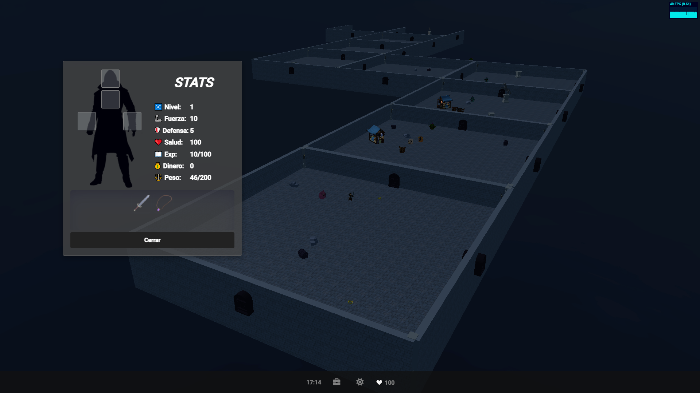

# Infinite-Autogenerated-RPG-3D-Game


Basic RPG browser game made with ThreeJs 😋

How to play?
- You can clone/download this repo and run it from visual code.

- If you use Windows, you can download the compiled game here:
https://drive.google.com/drive/folders/1yP-H3mu9hh8A7m20CajcdKPeyp5MDprl

- Or you can play it ONLINE here: https://sancode86.000webhostapp.com
(online option may take a while to load. If you get SSL error, 000webhostapp is fixing it)

## Features
- Inventory to manage your equipment. -> "I" Key ⌨️ or from game navbar.
- Chests with loot (randomly generated).
- Items collected or bought boost your attack or defense.  
- Enemies are generated based on your current character level.
- Random spawn of store, where you can buy stuff (generally better than looted items).
- Random generated rooms. With random models to decorate. They are simple of course, this is a demo 😅
- Boss encounters, more loot, harder to defeat.
- Rocks can be moved to trap enemies.
- Buffer can be activated (with a cooldown), gives you X2 strength. -> "☀️" button on navbar.
- "Rolling movement" (faster movement speed) -> "E" Key ⌨️
## Screenshots 



shadowMap is set to FALSE, for more performance:

```
<script>
  // RENDERER
  const renderer = new THREE.WebGLRenderer({ antialias: false });
  renderer.setSize(window.innerWidth, window.innerHeight);
  renderer.setPixelRatio(window.devicePixelRatio);
  renderer.shadowMap.enabled = false;
</script>
```
you can change it, be careful!
## Gameplay 
Short Gameplay:
(Notebook's zoom was set to 150% that's why everything is to "big")
https://youtu.be/eSEeJTUqYjE

Music, design and some sound effects made by me.
models from: https://quaternius.com/

coded with ❤️ and ☕
